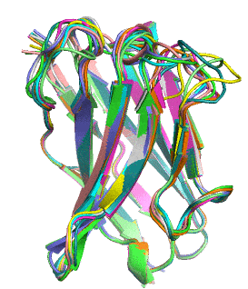
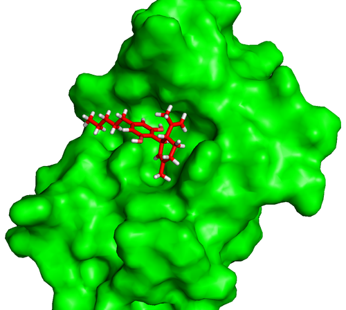
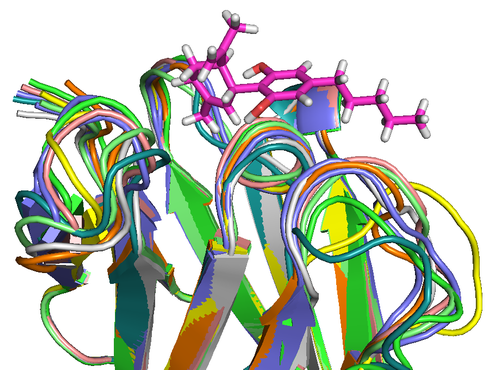
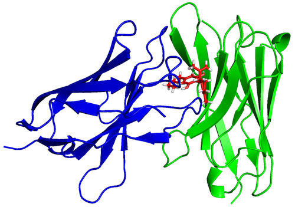
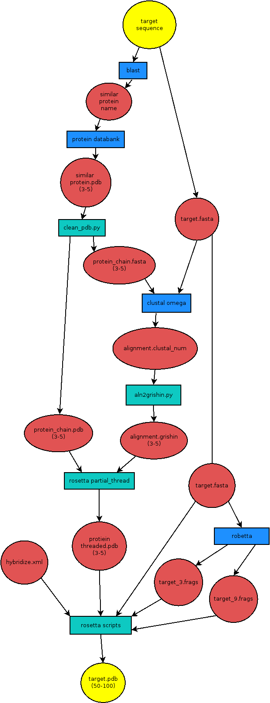

This article is based on research I did as a freshman undergrad, see the [full project
here](http://2018.igem.org/Team:Washington/Model).



Proteins naturally fold into their lowest energy configuration, just like a ball rolling down a
hill to a lower potential. This folded structure gives proteins their function, similar to
how which lock a key can open is determined by its shape, not the metal that makes it up.
Theoretically it is possible to calculate how a protein will fold just by using simple
electrostatic attraction of all a protein's atoms to each other.  However, modeling this process
on an atom-by-atom basis is NP-hard, meaning that it cannot be easily scaled to average size
proteins without a supercomputer.



[Rosetta][5] is a software suite for modeling and simulating complex proteins which is designed to help
solve such problems. Rosetta reduces the computational complexity of this problem by dividing the
sequence into fragments and substituting fragments of common folding patterns into the protein. It
simulates random conformations in space and performs a Monte Carlo algorithm to find the lowest
energy conformation. Essentially, random conformations are simulated to reduced the free energy in
an iterative process until optimal conformations are obtained. If the change reduced the free
energy, Rosetta continues from the new conformation. If the change increased the free energy, the
simulation reverts to the old conformation.

[5]: https://www.rosettacommons.org/

Homology modeling can be used to predict the structure of a protein from just
its amino acid sequence very quickly and accurately. Rosetta has builtin
homology modeling support through rosettacm. Homology modeling uses information
from other similar protein sequences structures to see how differences from the
known structure will effect the new structure of the protein you want. Because
you use previously mapped protein structures the quality and accurately of the
models you produce will depend on how similar the structures you find are to
your protein of interest. More similar proteins with less addition gaps lead to
faster and more accurate results.



The first step is to make a fasta file for your target sequence. This is simple
and can be done manually. An example is shown below. Change `name` to the name
of your protein this should match the name of your file (eg `5vnv.fasta`).

```
>name
EVQLQASGGGFVQPGGSLRLSCAASGSTSRQYDMGWFRQAPGKEREFVSAISSNQDQPPYYADSVKGRFTISRDNSKNTVYLQMNSLRAEDTATYYCAFKQHHANGAYWGQGTQVTVSS
```

Next you want to get the PDB files for around 2-5 similar proteins. This can be
done using a website called [blast][1]. Simply enter the target proteins sequence,
select to only show proteins with structures already mapped, and press enter.
This will query their database of known proteins and find the ones most
similar. You want to select proteins which are most similar and have the fewest
gaps. When choosing proteins it is often best to use the ones with the least
amount of addition gaps. Rosetta has a harder time adding new amino acids
compared to deleting ones or swapping residues out. So it is commonly a good
idea to select sequences which have a lower similarity score but have less gaps
and make less additions. Depending on the protein you are trying to simulate
there might be more options which are very similar so less than 5 proteins
would be needed.

[1]: https://blast.ncbi.nlm.nih.gov/Blast.cgi



Once you have selected your similar proteins you need to use another website
called the [protein databank][2] to download the PDB files you want. However this
PDB from the protein databank most likely contains chains you do not care
about, so you have to remove them for rosetta to understand which chains you
want to simulate. Luckily rosetta comes with a python script called
`clean_pdb.py` to do exactly this. Simply give this script the PDB file name
and the chain you want to keep. This program will also produce a fasta file for
the sequence of the chain which is needed in the next step.

[2]: http://www.rcsb.org/

Yet another website, [clustal omega][3], is used to combine all the similar and the
target protein sequences so they can be easily compared by rosetta. The file it
outputs however can not be understood by rosetta, so I wrote a [python script][4]
to convert this clustal file into one rosetta can read, grishin.

[3]: https://www.ebi.ac.uk/Tools/msa/clustalo/
[4]: https://edryd.org/projects/aln2grishin/

This grishin alignment file and the similar protein PDBs are then given to
rosetta to generate a protein threaded PDBs for each input PDB. These threaded
PDBs, the target sequence fasta file and a rosettacm XML file are then all
given to another rosetta program to generate the target protein's PDB file. It
is recommended you generate anywhere from 50-200 PDBs depending on how quickly
the results seem to converge.

```
$ rosetta/main/source/bin/partial_thread.default.linuxgccrelease -in:file:fasta molxa3.fasta -in:file:alignment molxa3_6dbeA.grishin -in:file:template_pdb 6dbeA.pdb
```

A full flow-diagram for this process can be seen below:


