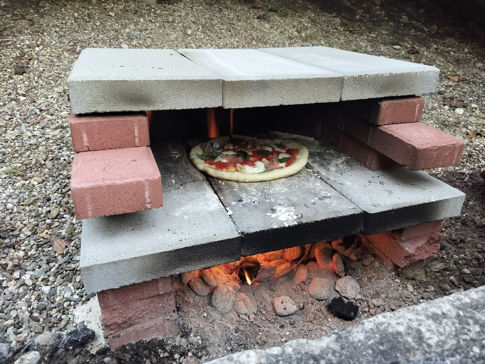

Everyone loves pizza,
and there's no better pizza than homemade.

The main barrier to making pizza at home is a hot enough surface
to quickly cook the bottom of the pizza,
giving it the crispy texture all good pizza needs.
**The best way to achieve this is with a dedicated pizza oven.**
The fire under the pizza surface heats it to over 700° F,
and pushes hot air over the pizza to cook it evenly all around,
while not burning the crust.

Luckily, a pizza oven doesn't have to be expensive,
you can build one yourself in an afternoon for less than $100.
Equipped with what is essentially a stack of bricks,
you can make your own pizza which easily surpasses any chain brand,
giving you another reason to be elitist about pizza.

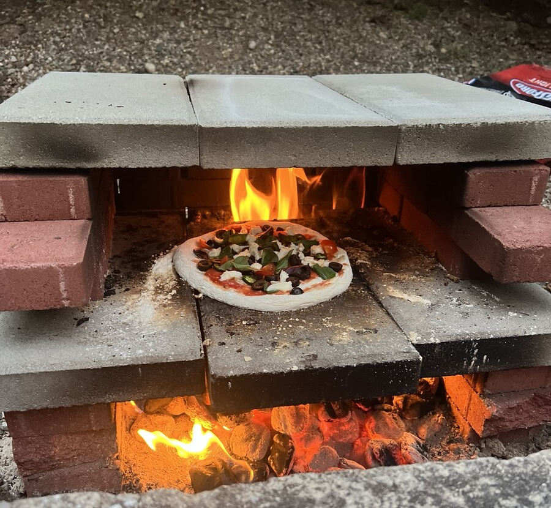

If you don't have outside space to build an oven,
using a pizza stone in your kitchen's oven gives you a close approximation.
While it does not get as hot as an actual pizza oven,
leaving the bottom not as crispy as it should be,
it still makes great pizzas.

I built this pizza oven at the end of last summer,
unfortunately we were only able to use it a few times
before our landlord forced us to abandon it when they sold our house.
I wanted to document how to build it for future reference,
and save a record to help others build their own.

# Supplies

1. **Bricks** (42x)
   - Just your regular old red bricks.
2. **Stone slabs** (2x)
   - Total size of 24"x16" for each, but can be split into multiple pieces.
3. **Metal support bar**
   - If your stone slabs are not one piece like mine, you will need a flat metal bar to support them.
4. **Bubble Level**
   - Helps make sure your foundation is level!
5. **Pizza Peel**
   - While not needed for the actual oven, you will need it to make the pizza.

## Optional

4. **Grout**
   - If the surface you are building is not super level, use grout to smooth it out.
   - No grout is used in between the bricks.
5. **Laser thermometer**
   - Measure how hot the surface is so you know when the oven is ready.
6. **Metal grate**
   - Place under charcoal with small hole dug out underneath to improve airflow and help the fire stay lit.

# Steps

## Clear out space

Find a 24"x14" size area of flat land,
far from anything flammable.
Preferably on a smooth easy-to-level surface,
like fine dirt.

If you are building on a rough surface
(gravel, rocks, coarse dirt, etc),
using grout is necessary to make the foundation even.

## First layer

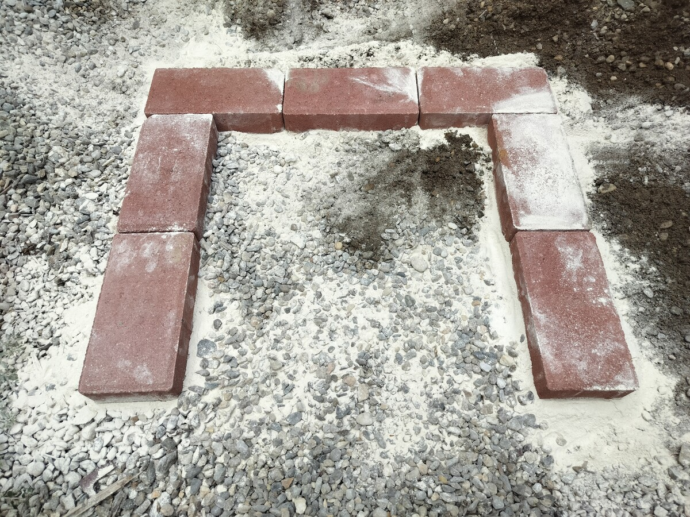

Start by laying out 7 bricks in a upside down U shape.
This is the first layer of where the fire will be made.

This layer is the most important since all other bricks will be placed on it.
Make sure it is as level as possible,
as any slight deviations will add up and cause problems later on.

Place each brick firmly in the grout,
use a bubble level in both directions to ensure it is as flat as you can get.
Spend as much time as you need on this step,
because otherwise you will have to redo the whole thing
(don't ask me how I know).

## Second layer

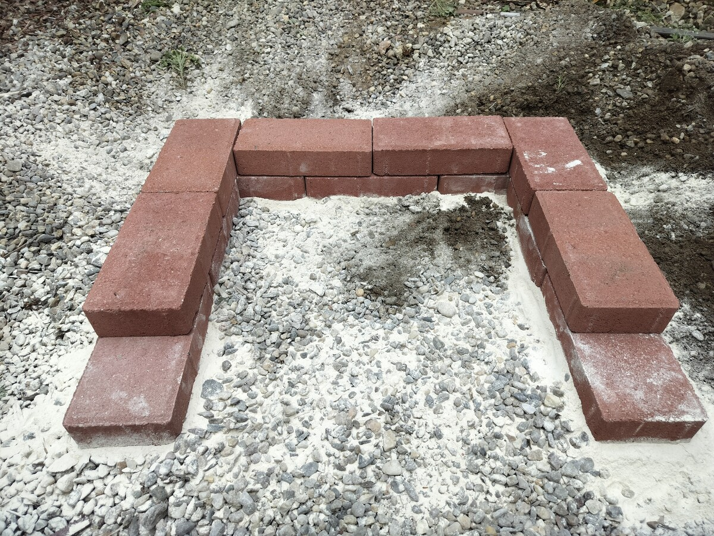

Add 6 bricks on top in a offset pattern to add structure.

## Third layer

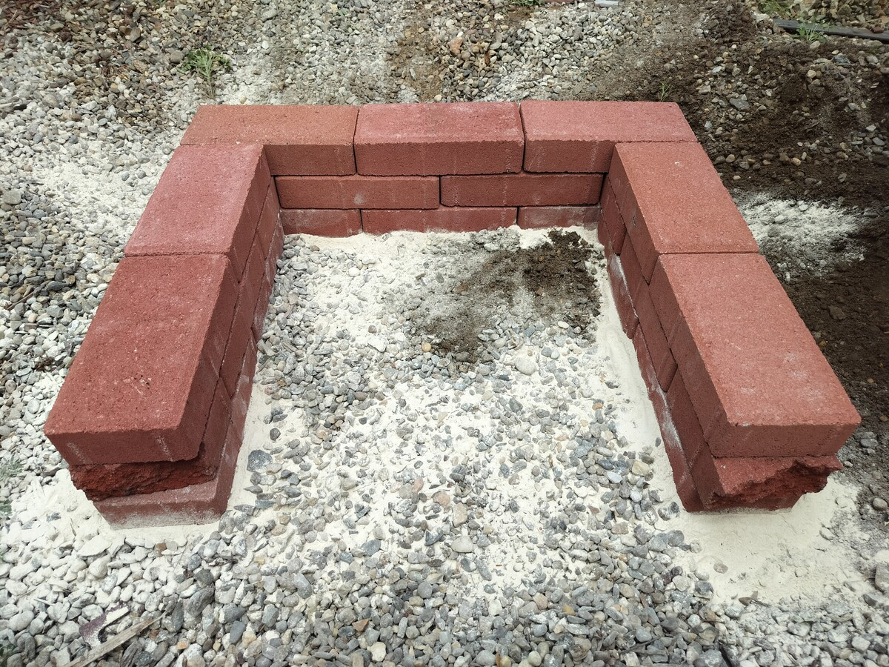

Now 7 more bricks again.

I had an extra brick which was broken in half,
so I placed it underneath this layer and the two ends.
This is not structurally necessary,
it just makes it look more even at the front.

## Pizza Surface

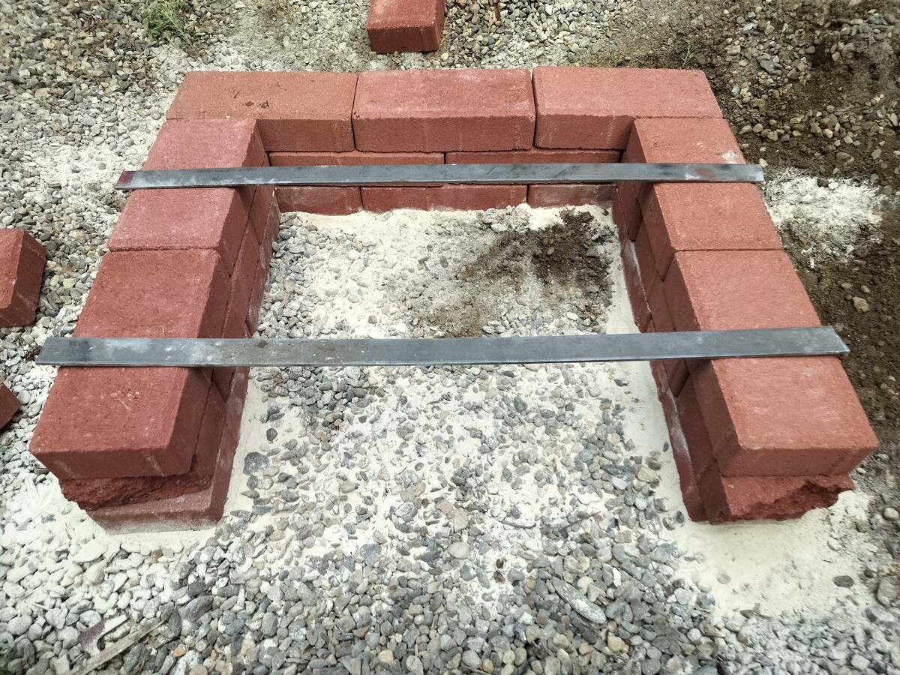

If your stone slab comes in multiple parts,
use support bars to hold the middle.

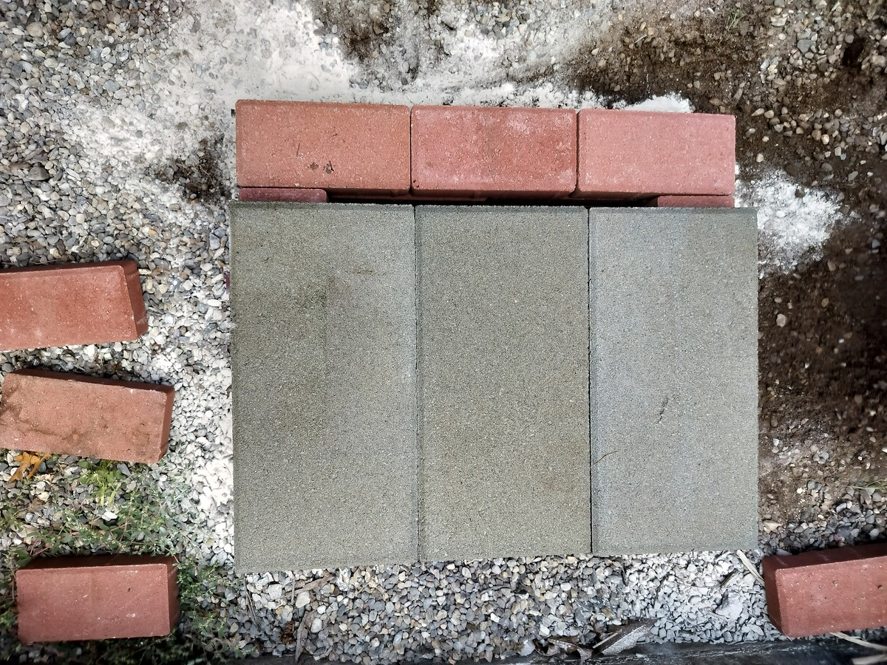

Now lay the large stone slab on top,
leaving a gap between the back wall for air flow.
Also place 3 more bricks on top of the back wall to complete the layer (not pictured).

## Fifth layer

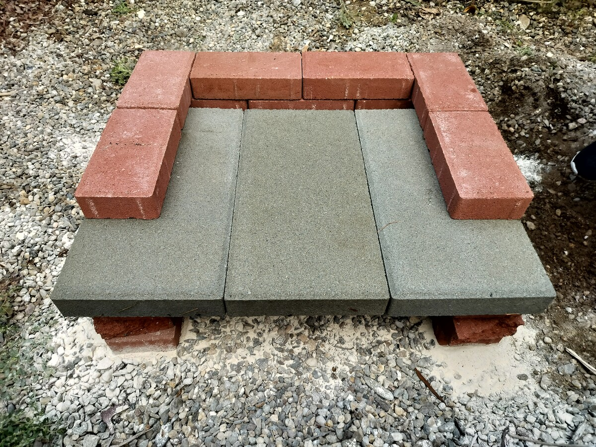

Next is the first layer of the pizza section,
where you will eventually cook the pizza.
Place 6 more bricks in the pattern above.

## Sixth layer

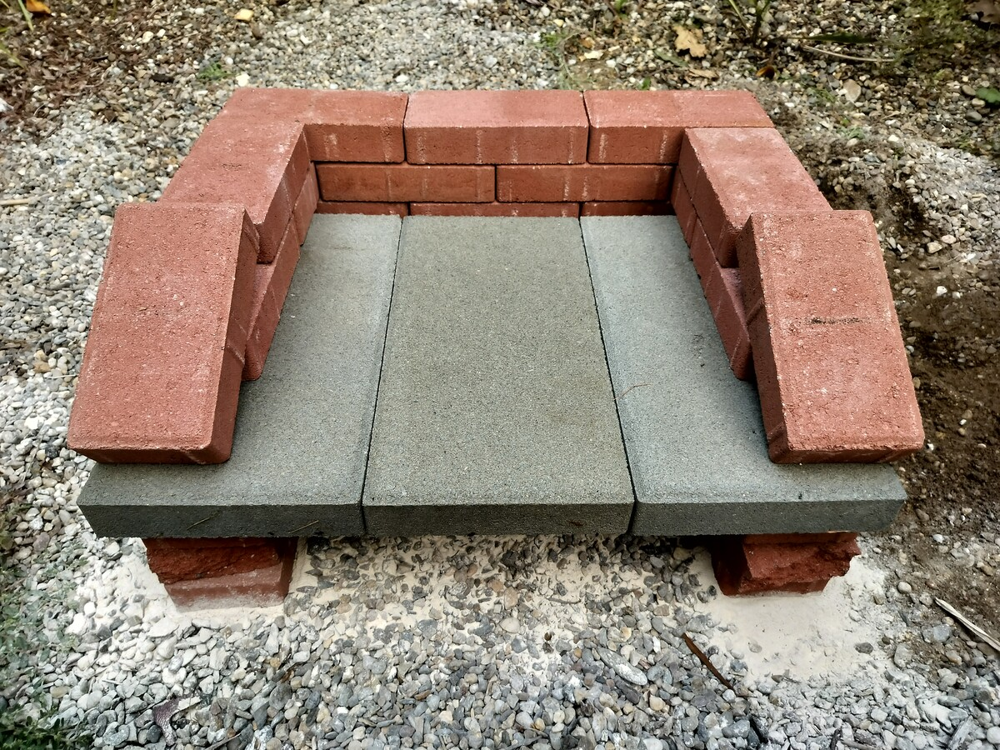

You know the drill by now,
place 7 more bricks to form the next layer.
The bricks on the two ends will fall down until you place the next layer on top.

## Seventh layer

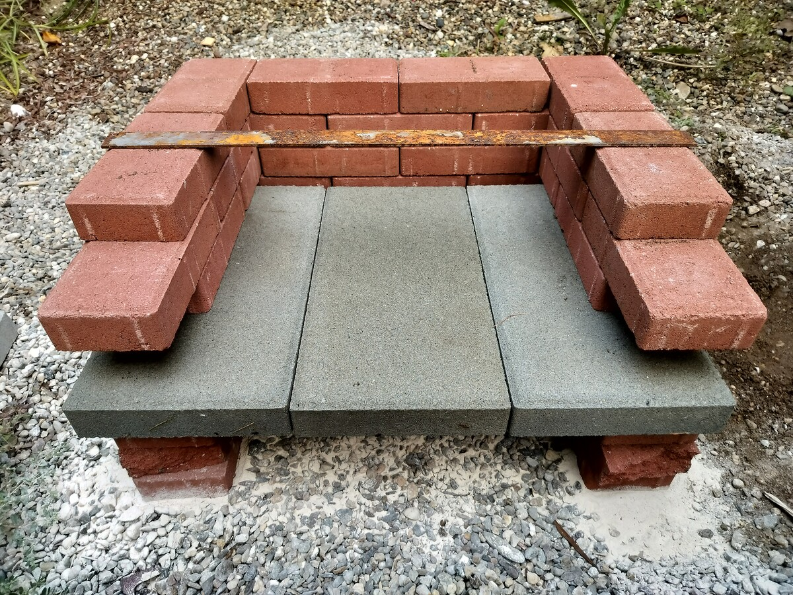

The final layer of bricks can now be placed.

You can also add the support bar for the roof.
If your slab is in one or two pieces you might not need a support bar
since the roof slab will be placed on top of the back wall this time.
But because mine is three separate slabs I need another support bar.

## Roof

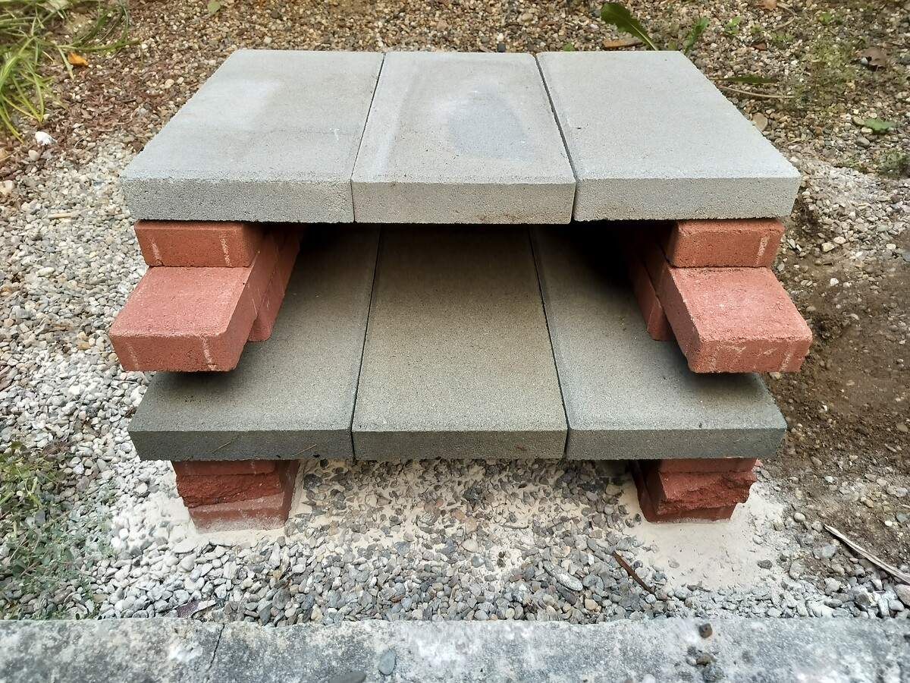

Place your second stone slab on top to complete the roof.

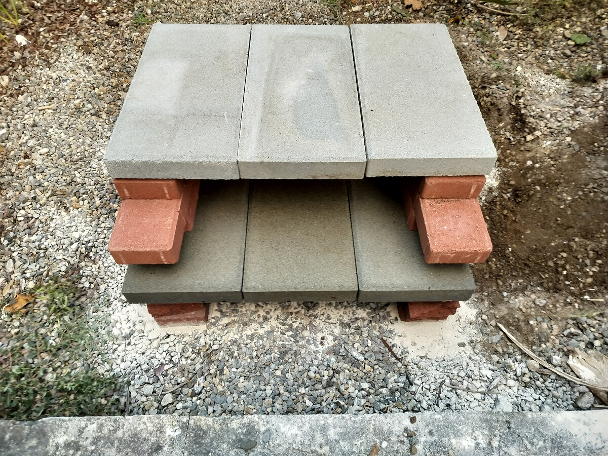

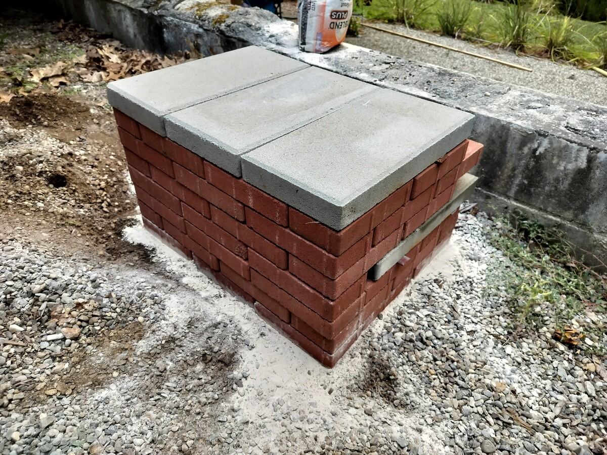

# Conclusion

Congratulations, you now have a fully functional pizza oven!

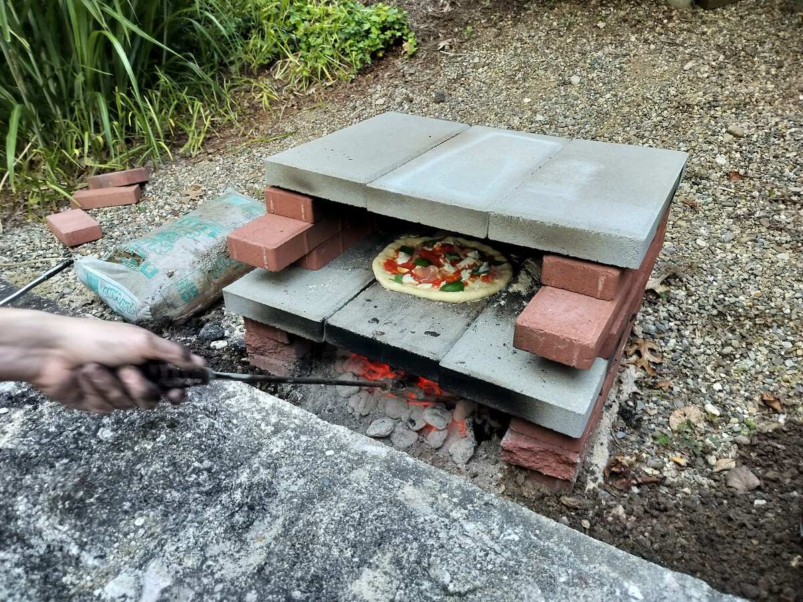

Throw some charcoal on the bottom and light a fire.
Wait for the middle surface to warm up to 500-700⁰F
and slide your raw pizza off the peel into the oven to cook it.
After 2-3 minutes and the cheese has started to boil,
remove the pizza and enjoy the fruits of your labor!

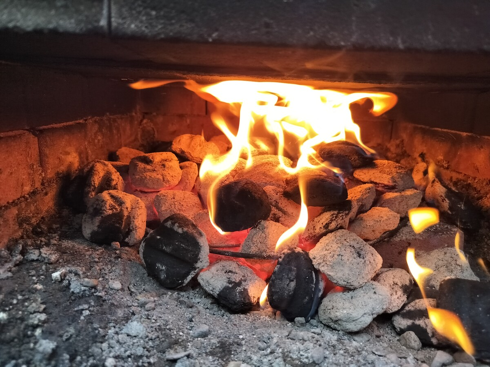

If you have trouble lighting the charcoal fire,
I found it helpful to dig out a small shallow pit
and place a grate over so extra air flow can get under the charcoals.

Stay tuned for future posts where I share the best way to make your own pizza dough!
